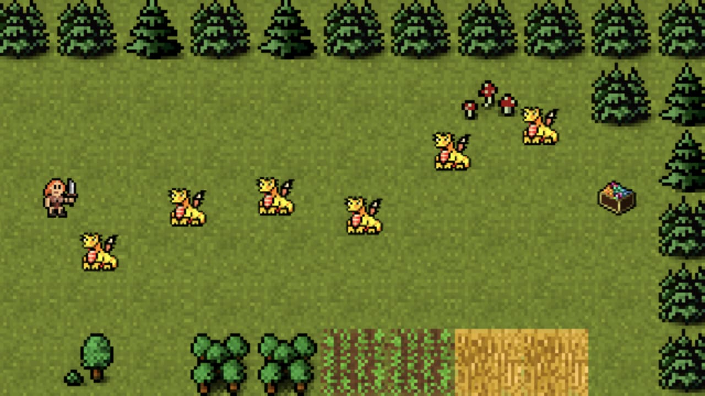
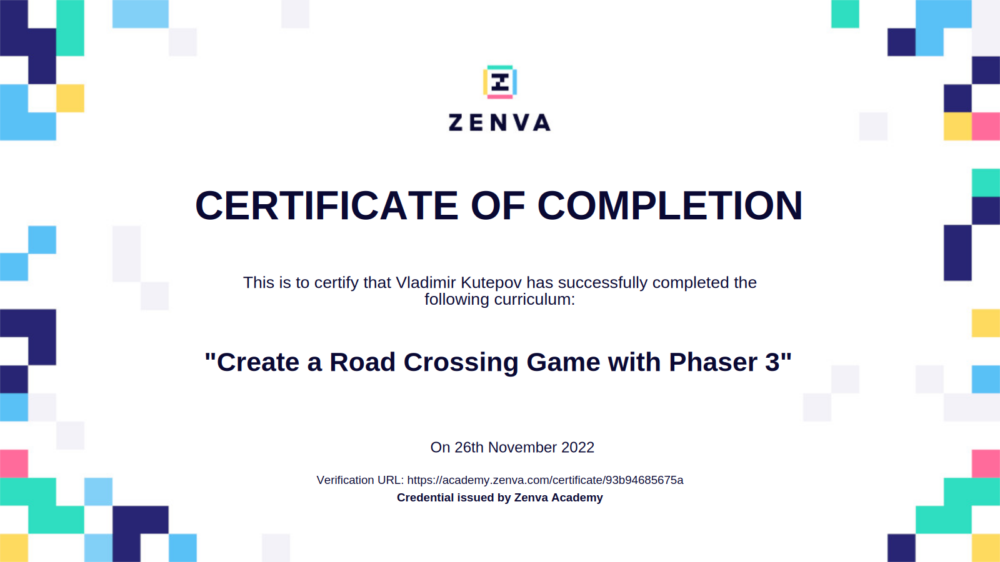

# Create a Road Crossing Game with Phaser 3

Zenva Course URL: https://academy.zenva.com/course/create-a-road-crossing-game-with-phaser-3/

HTML5 game framework Phaser: https://phaser.io/

[Click here](https://frenzzy.github.io/edu-game-phaser3-a-road-crossing/public/) to play a Road Crossing game:

[Click here](https://academy.zenva.com/certificate/93b94685675a) to see the certificate of completion:

